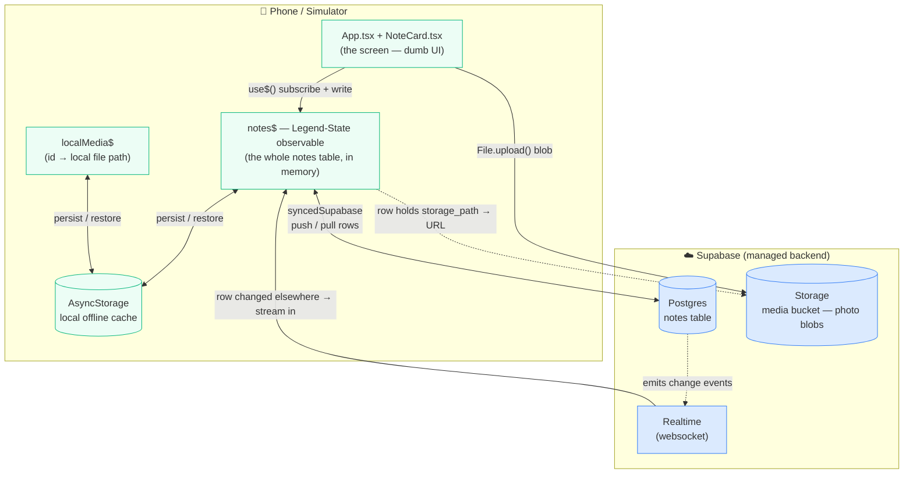
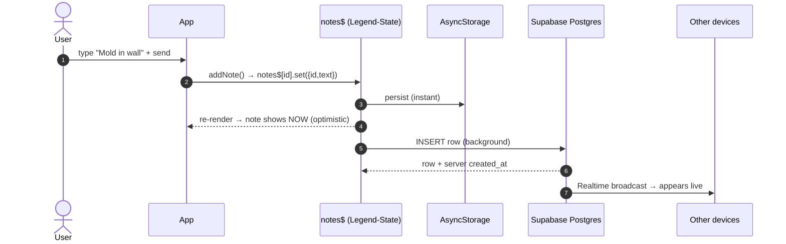
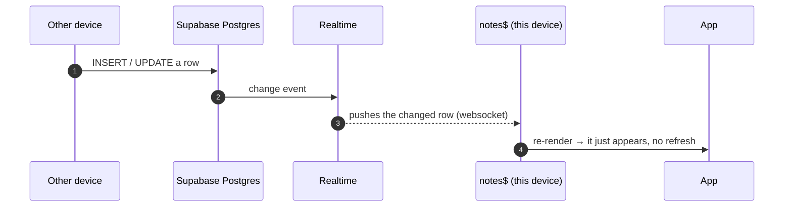
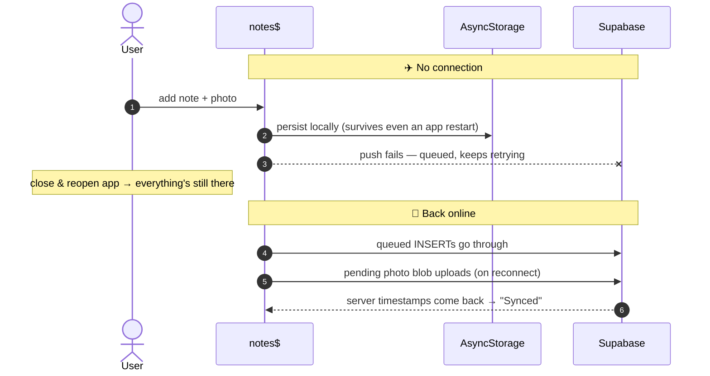
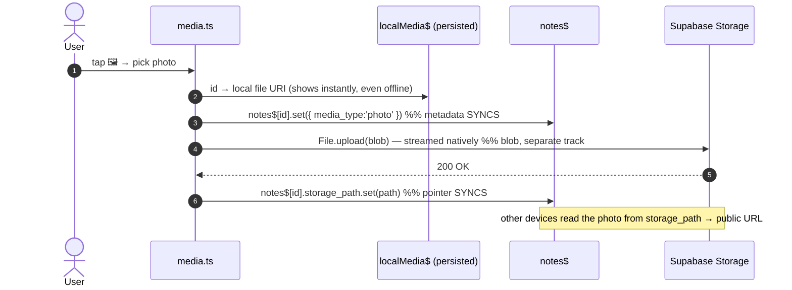

# How POC 1 Works — Legend‑State + Supabase

A guided walkthrough of the offline‑first notes app, written for someone **new to Legend‑State and Supabase Realtime**. Read it top to bottom and you'll be able to explain the whole thing on a call.

---

## 1. What this POC is

A single screen — "field notes" for a restoration technician. You can add **text notes** and **photos**, and everything:

- works **with no internet** (you can keep writing in a flooded basement),
- **persists** if you close the app,
- **syncs automatically** to the cloud when you're back online,
- shows up **live on other devices** (real‑time).

It's intentionally small. The point isn't the feature set — it's to **feel** how little code offline‑first + realtime takes with Legend‑State + Supabase.

---

## 2. The one big idea: *offline‑first*

A normal app talks to the server for everything:

```
UI  →  API  →  Database
```

If the network is down, the app is dead. **Offline‑first flips this around.** The app talks to a **local store** that is the *source of truth for the UI*. A **sync engine** quietly moves data between that local store and the server in the background.

```
UI  ⇄  Local store (instant, always available)  ⇄  [sync engine]  ⇄  Server
```

So a write is **instant and local first**, then it syncs "whenever." The user never waits for the network, and never sees a spinner for a save. That's the whole magic, and Legend‑State gives it to us almost for free.

---

## 3. Architecture at a glance



**The key insight to say out loud:** the UI only ever reads/writes the **observable** (`notes$`). It never calls the network directly. Legend‑State handles "persist it locally," "push it to Supabase," and "pull other people's changes" automatically. *That* is what makes it offline‑first.

---

## 4. The three technologies (plain English)

### Legend‑State — reactive state + sync
A small state library. Three things to know:

| Concept | What it is |
|---|---|
| `observable(x)` | A reactive store. Reading/writing it is normal JS; anything watching it updates automatically. |
| `use$(obs)` | A React hook: "subscribe this component to this observable." The component re‑renders on any change. |
| `syncedSupabase` | A **plugin** that wires an observable to Supabase: local persistence + push/pull + realtime — configured once. |

Think of `notes$` as **"the entire `notes` table, living in memory, that magically stays in sync with Postgres and with the disk."**

### Supabase — the managed backend
Postgres + a few services on top, all hosted:

| Service | Used for |
|---|---|
| **Postgres** | The `notes` table (the real database). |
| **Realtime** | A websocket that broadcasts every row change to subscribed clients → live updates across devices. |
| **Storage** | Object storage for file blobs (our photos), like an S3 bucket but built‑in. |
| Auth | (not used in this POC) |

### AsyncStorage — the local cache
React Native's simple on‑device key‑value store. It's **where the offline copy lives**. (It's slower than MMKV; production would swap to MMKV in one line + a dev build. At POC scale it's invisible.)

---

## 5. The files

```
01-legend-supabase/
├── config.ts            Supabase URL + publishable key
├── state.ts        ★    THE SYNC ENGINE — the observable + syncedSupabase wiring
├── media.ts        ★    Photo pipeline — Supabase Storage upload, offline media
├── App.tsx              The screen (header, list, input) wired to the observable
├── NoteCard.tsx         One feed card (dumb, presentational)
├── ui.ts                Small pure helpers (avatar color, relative time…)
├── styles.ts            All StyleSheet styles
├── supabase.sql         Run 1st — notes table + Realtime
└── supabase-storage.sql Run 2nd — media bucket + media columns
```

The two **★** files are the whole story. `App/NoteCard/ui/styles` are "just the UI" and know nothing about Supabase.

### `state.ts` — the heart (≈30 lines that matter)
```ts
const customSynced = configureSynced(syncedSupabase, {
  supabase,
  persist: { plugin: observablePersistAsyncStorage({ AsyncStorage }) }, // offline cache
  generateId: () => Crypto.randomUUID(),   // client-made UUIDs (so we can create rows offline)
  changesSince: 'last-sync',               // only pull what changed (delta sync)
  fieldCreatedAt: 'created_at',
  fieldUpdatedAt: 'updated_at',
  fieldDeleted: 'deleted',                 // soft-delete tombstones sync too
});

export const notes$ = observable(customSynced({
  collection: 'notes',   // the Supabase table
  realtime: true,        // subscribe to Realtime
  persist: { name: 'notes', retrySync: true },
  retry: { infinite: true },
}));

export function addNote(text: string) {
  const id = Crypto.randomUUID();
  notes$[id].set({ id, text });   // ← that's the entire "save". Local + sync + realtime, free.
}
```
**One `observable(...)` call buys offline persistence, optimistic writes, automatic sync, and realtime.** Compare that to hand‑writing an outbox + push/pull + a REST API.

### `media.ts` — photos, done right
The rule: **never push the binary blob through the sync layer.** Only the *metadata* (`media_type`, `storage_path`) rides Legend‑State; the actual file goes to Supabase Storage on its own track (`File.upload()`, streamed natively).

---

## 6. Data flows (the diagrams that explain everything)

### A) Add a note while **online**

The user sees the note **immediately** (step 4), before the server even hears about it (step 5).

### B) A change arrives from **another device** (realtime)


### C) **Offline → reconnect** (the headline demo)


### D) **Photo capture** (metadata vs. blob)


---

## 7. Concepts worth understanding (likely Q&A)

- **Optimistic writes** — the UI updates from the local store immediately; sync happens after. No save spinners.
- **Delta sync** (`changesSince: 'last-sync'`) — on reconnect we only pull rows that *changed* since our last sync, not the whole table. Efficient.
- **Client‑generated IDs** (`Crypto.randomUUID()`) — we can create rows **offline** with a real primary key, no server round‑trip needed.
- **Soft deletes / tombstones** — deleting sets `deleted = true` (which *syncs*) instead of removing the row. A **hard** delete in the DB leaves no trace for delta‑sync to notice, so other devices wouldn't learn about it — that's why offline‑first apps soft‑delete. (Long‑press a card to see it.)
- **Metadata vs. blob** — small structured data syncs through Legend‑State; large binaries go to Storage separately and are referenced by a tiny `storage_path` string.
- **Sync status pill** — driven by Legend‑State's `syncState`: `error → Offline`, `isGetting/isSetting → Syncing`, else `Synced`.

---

## 8. Hard‑won gotchas (also in CLAUDE.md)

1. **Never stamp `created_at` yourself.** Legend‑State reads its *presence* as "row already exists" → it issues an `UPDATE` (0 rows) instead of an `INSERT`, and the note **silently never syncs**. Let the DB set it.
2. **Upload images by streaming, not `fetch`.** RN's `fetch` loads the whole image into a JS ArrayBuffer and POSTs it at once; iOS drops multi‑MB bodies ("network connection lost"). We use `expo-file-system` `File.upload()` to stream from disk.
3. **Persist the local‑media map.** `localMedia$` (id → file path) is persisted so a photo captured offline can still upload after an app restart.
4. **Un‑synced notes sort by a local counter**, not `created_at` (which they don't have yet) — missing timestamp means *newest*, not oldest.
5. **After adding/removing a native module, `expo start --clear`.** HMR on top of a native‑module change wedges the bundle.

---

## 9. Demo script (≈90 seconds)

1. **Online:** add a note + a photo → they appear instantly and the pill says **Synced**. (If you have a second device / the Supabase table open, show it appear there live.)
2. **Wi‑Fi off:** pill flips to **Offline**. Add a note + photo → still instant, tagged **Syncing / Uploading**, sorted to the top.
3. **Force‑quit and reopen** (still offline) → everything's still there. *"The local store is the source of truth."*
4. **Wi‑Fi on** → pill flips to **Synced**; the queued note and the **photo taken with no signal** upload automatically.

The pitch: *the field tech keeps working in a basement with no signal, and it all syncs the moment they're back — photos included.*

---

## 10. Mini‑glossary

| Term | Meaning |
|---|---|
| **Observable** | A reactive value; watchers re‑run when it changes (Legend‑State). |
| **`use$`** | React hook to subscribe a component to an observable. |
| **`syncedSupabase`** | Legend‑State plugin: persistence + push/pull + realtime to Supabase. |
| **Realtime** | Supabase websocket that streams DB row changes to clients. |
| **Storage** | Supabase object storage (file blobs), referenced by `storage_path`. |
| **AsyncStorage** | On‑device key/value cache — where the offline copy lives. |
| **Optimistic write** | Update the UI from local state first, sync after. |
| **Tombstone** | A soft‑delete marker (`deleted = true`) that syncs, so deletes propagate. |
| **Delta sync** | Pull only rows changed since the last sync, not everything. |
