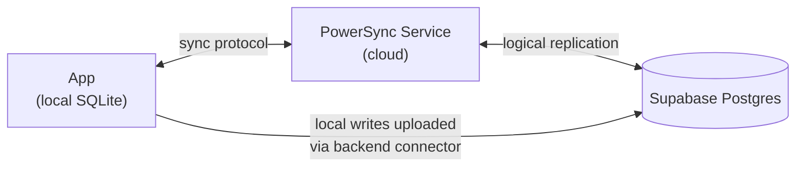

# POC 2 — Supabase + PowerSync

The same field-notes app as POC 1, but the **sync engine is PowerSync** instead of Legend-State.
Purpose: a head-to-head feel for the two approaches for Moby's offline-first restoration app.

## How it differs from POC 1 (the comparison)
| | POC 1 (Legend-State) | POC 2 (PowerSync) |
|---|---|---|
| Local store | in-memory observable + AsyncStorage | **on-device SQLite** |
| Sync transport | Supabase Realtime (direct to Postgres) | **PowerSync Service** (a cloud sync engine in front of Postgres) |
| Infra to run | just a Supabase project | Supabase **+ a PowerSync Cloud instance** |
| Runs in Expo Go? | ✅ yes | ❌ **no — needs a dev build** (native SQLite) |
| Reads in the UI | `use$(notes$)` | `useQuery('SELECT … FROM notes')` |
| Conflict / scale story | last-write-wins, whole dataset in memory | SQLite + buckets, built for large datasets & complex queries |
| Best for | smallest setup, fastest start | large datasets, offline at scale, battle-tested sync |



The app **reads and writes local SQLite only** — it never touches the network directly. PowerSync
streams Postgres rows *down* into SQLite, and our `uploadData` connector pushes local changes *up* to
Supabase. That indirection is what makes it offline-first: with no signal, reads and writes still work
against the local DB, and the queue drains on reconnect.

## Setup (verified on the iOS simulator)
> Same Supabase project as POC 1 — the `notes` table and `media` bucket are **reused**. You only add
> the PowerSync-specific pieces below.

1. **In Supabase** → SQL editor → run **`powersync.sql`**. It creates the `powersync` publication and a
   `powersync_role WITH REPLICATION BYPASSRLS` (logical replication is how PowerSync reads Postgres).
   Set a real password in that file first.
2. **Create a PowerSync Cloud instance** at <https://powersync.com> (free tier), connect it to Supabase
   Postgres with the **`powersync_role`** credentials (Supabase → Project Settings → Database for host).
   Copy the **instance URL** → `config.ts` → `POWERSYNC_URL`.
3. **Deploy the sync config via the CLI** (the dashboard editor didn't take for us — see Gotchas):
   ```bash
   npx powersync@latest login
   npx powersync@latest link cloud --instance-id=<id> --project-id=<id>
   # with sync-rules.yaml copied to powersync/sync-config.yaml:
   npx powersync@latest deploy sync-config
   ```
   This deploys **Sync Streams** (edition 3) — one stream syncing all `notes`. Success looks like
   `Validated and applied checkpoint` in the app logs.
4. **Auth token:** no login in this POC, so use a **development token** (PowerSync dashboard → instance →
   Client Auth → temporary token, ~12h; or the CLI). Paste into `config.ts` → `POWERSYNC_TOKEN`.
   Production would mint Supabase Auth JWTs in `fetchCredentials` instead.
5. **Dev build** (native SQLite ⇒ no Expo Go):
   ```bash
   pnpm install
   pnpm exec expo prebuild
   pnpm exec expo run:ios     # or run:android
   ```

## Status
✅ **Text notes sync both ways** — verified in the iOS simulator (rows added in Supabase stream down
into the app; notes typed in the app appear in Postgres). Offline writes queue locally and drain on
reconnect. Soft-deletes (`deleted = 1`) propagate as tombstones.

🚧 **Media is the next step.** Photo capture/display will reuse POC 1's native streaming upload to
Supabase Storage, with the note→file-URI map kept in the `local_media` *local-only* SQLite table (the
PowerSync equivalent of POC 1's persisted `localMedia$`). The buttons are stubs until then.
