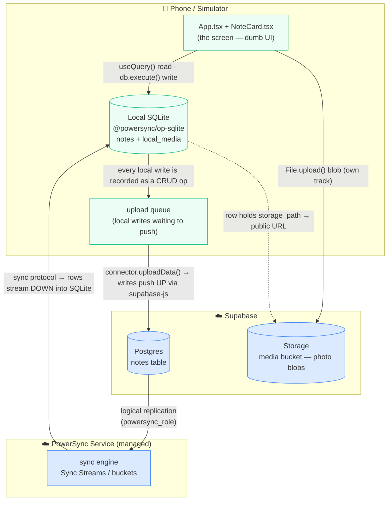
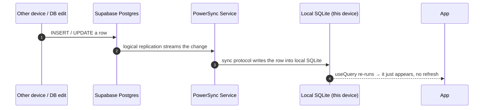
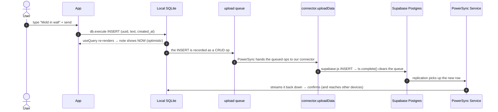
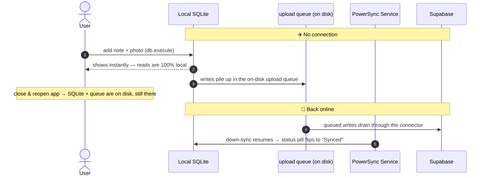
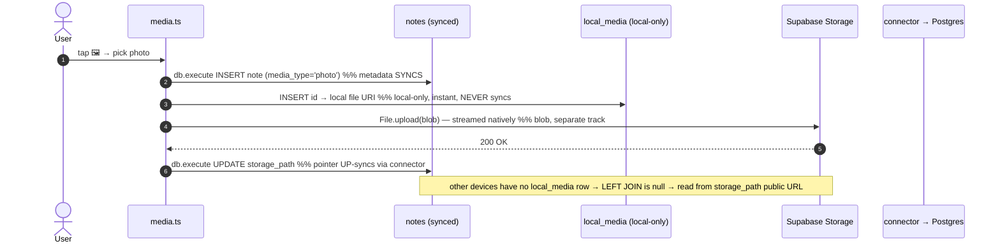

# How POC 2 Works — Supabase + PowerSync

A guided walkthrough of the **same** field‑notes app as POC 1, but with **PowerSync** as the sync
engine instead of Legend‑State. Written for someone **new to PowerSync**. Read it top to bottom and
you'll be able to explain it — and, more importantly, **contrast it with POC 1** — on a call.

> If you haven't read `HOW_IT_WORKS_POC1.md` yet, skim its sections 1–2 first; the "offline‑first" idea
> is identical here. This doc focuses on **what PowerSync does differently**.

---

## 1. What this POC is

The exact same screen as POC 1 — "field notes" for a restoration technician: add **text notes** and
**photos**, works **offline**, **persists** across restarts, **syncs** when back online, shows up **live**
on other devices.

Same app, same feature set, same Supabase project (it reuses POC 1's `notes` table and `media` bucket).
**Only the sync engine changed.** The whole point is to feel that difference.

---

## 2. The one big idea is the same: *offline‑first*

The UI talks to a **local store** that is the source of truth; a **sync engine** moves data to and from
the server in the background. A write is **instant and local first**, then syncs "whenever."

What changes in POC 2 is **what the local store is**:

| | POC 1 | POC 2 |
|---|---|---|
| Local store | an **in‑memory observable** backed by AsyncStorage | a real **on‑device SQLite database** |

That single change is the reason PowerSync scales to **large datasets and complex queries** — you're
holding an actual SQL database on the phone, not a JS object in memory.

---

## 3. The PowerSync shape: a service in the middle, and a *split* read/write path

This is **the** mental model to internalize. In POC 1, one Legend‑State plugin (`syncedSupabase`) did
*both* directions straight to Postgres (plus Realtime). PowerSync **splits the two directions**:

- **DOWN (server → device) is owned by the managed PowerSync Service.**
  `Postgres → logical replication → PowerSync Service → sync protocol → device SQLite`.
  The Service watches Postgres and **streams** the rows each client is allowed to see into its local DB.

- **UP (device → server) is owned by *your* code.**
  `device SQLite → on‑disk upload queue → your backend connector → Supabase`.
  PowerSync records every local write and hands them to **your** `uploadData()` function, which applies
  them to Supabase (via `supabase-js`). PowerSync does **not** write to your database for you.

The loop closes because a write you push **up** into Postgres then comes back **down** the read path to
*every* device (including the one that wrote it — that's the "Synced" confirmation).

> **Say this out loud on the call:** *"With PowerSync the read path and the write path are different
> things. Reads stream down from a managed service that mirrors Postgres into on‑device SQLite. Writes
> go up through a connector I control, into my own backend. The UI only ever touches local SQLite."*

---

## 4. Architecture at a glance



**The key insight:** the UI never calls the network. It reads local SQLite with `useQuery` and writes it
with `db.execute`. PowerSync streams Postgres **down** into that SQLite, and the connector pushes local
changes **up** to Supabase. Photos are the one thing that bypasses all of this (see §7‑D).

---

## 5. The technologies (plain English)

### PowerSync — a managed sync service + a client SDK
Three parts to know:

| Part | What it is |
|---|---|
| **PowerSync Service** (cloud) | A hosted engine that connects to your Postgres via **logical replication** and **streams** the relevant rows down to each client. This is the piece POC 1 didn't have. |
| **Client SDK** (`@powersync/react-native`) | Gives you `PowerSyncDatabase`, the `Schema`, `useQuery`/`useStatus` hooks, and the upload queue. |
| **`@powersync/op-sqlite`** | The actual **on‑device SQLite** engine (native). It's why this needs a dev build, not Expo Go. |

| Concept | What it is |
|---|---|
| **Sync Streams** (a.k.a. Sync Rules) | Server‑side config that decides **what data each client downloads**. No auth here, so every client gets one global stream of *all* notes. Real apps filter: `WHERE company_id = auth.user_id()`. |
| **Backend connector** | Your `uploadData()` (push local writes to Supabase) + `fetchCredentials()` (the auth token). The **only** code that talks to your backend. |
| **`useQuery(sql)`** | A **live** SQL query over local SQLite — re‑runs and re‑renders whenever any table it touches changes (a local write *or* a row streamed in). |

### Supabase — the managed backend (same project as POC 1)
| Service | Used for in POC 2 |
|---|---|
| **Postgres** | The `notes` table — same as POC 1. |
| **Logical replication** | How the **PowerSync Service** reads Postgres (publication `powersync` + a `powersync_role`). This *replaces* POC 1's use of **Realtime**. |
| **Storage** | Photo blobs — identical to POC 1. |

> Note: POC 2 does **not** use Supabase **Realtime**. PowerSync's down‑sync stream already *is* the live
> channel. Realtime was a POC‑1 thing.

---

## 6. The files

```
02-powersync-supabase/
├── config.ts             Supabase URL + anon key, POWERSYNC_URL, POWERSYNC_TOKEN (dev token)
├── state.ts         ★    THE HEART — SQLite schema + PowerSyncDatabase + addNote/deleteNote
├── PowerSyncConnector.ts ★  The backend connector — fetchCredentials + uploadData (push to Supabase)
├── media.ts         ★    Photo pipeline — Storage upload + the local-only local_media map
├── App.tsx               The screen — useQuery + useStatus, wired under PowerSyncContext
├── NoteCard.tsx          One feed card (dumb, presentational — unchanged from POC 1)
├── ui.ts / styles.ts     Pure helpers + StyleSheet
├── powersync.sql         Run in Supabase — the logical-replication publication + powersync_role
└── sync-rules.yaml       The Sync Streams config — deployed via the PowerSync CLI
```

The three **★** files are the whole story. `App/NoteCard/ui/styles` are "just the UI."

### `state.ts` — local SQLite + the database
```ts
const notes = new Table({                 // NEVER declare `id` — PowerSync adds it (TEXT primary key)
  text: column.text,
  media_type: column.text,
  storage_path: column.text,
  created_at: column.text,                // dates are ISO strings (column.text)
  updated_at: column.text,
  deleted: column.integer,                // booleans are 0/1 (column.integer)
});
const local_media = new Table({ uri: column.text }, { localOnly: true }); // device-only, never synced

export const AppSchema = new Schema({ notes, local_media });

export const db = new PowerSyncDatabase({
  schema: AppSchema,
  database: new OPSqliteOpenFactory({ dbFilename: 'moby.db' }), // explicit — see gotcha #1
});

export async function addNote(text: string) {
  await db.execute("INSERT INTO notes (id, text, created_at) VALUES (uuid(), ?, datetime('now'))", [text]);
} // ← that's the whole "save": a local SQLite write. PowerSync queues the upload for you.
```

### `PowerSyncConnector.ts` — the only code that talks to your backend
```ts
const connector = {
  // 1) AUTH: where to sync + the token proving who we are.
  fetchCredentials: async () => ({ endpoint: POWERSYNC_URL, token: POWERSYNC_TOKEN }),

  // 2) PUSH: PowerSync hands us the queued local writes; we apply them to Supabase.
  uploadData: async (database) => {
    const tx = await database.getCrudBatch();
    if (!tx) return;
    for (const op of tx.crud) {
      // op.op is PUT / PATCH / DELETE; op.table, op.id, op.opData → translate to a supabase-js call
    }
    await tx.complete();   // ← MANDATORY, or the upload queue stalls forever (gotcha #4)
  },
};
```

### `media.ts` — photos (same principle as POC 1)
Never push the blob through the sync engine. Only `media_type` + `storage_path` ride PowerSync; the file
goes to Supabase Storage via native streaming `File.upload()`. The note → device‑file‑URI map is a row in
the **local‑only `local_media`** table, which `App.tsx` `LEFT JOIN`s into its read query so the photo
shows instantly on the capturing device.

---

## 7. Data flows (the diagrams that explain everything)

### A) A change arrives from Postgres → streams **down** (this is also "realtime")


### B) Add a note while **online** (note the round‑trip)

The user sees the note **immediately** (step 3), before the server hears about it (step 6). The write
travels **up** through the connector, lands in Postgres, then comes **down** the read path to everyone.

### C) **Offline → reconnect** (the headline demo)


### D) **Photo capture** (metadata syncs, blob doesn't, file URI stays local)


---

## 8. POC 1 vs POC 2 — the comparison (the gold for Senthil)

| | **POC 1 — Legend‑State** | **POC 2 — PowerSync** |
|---|---|---|
| Local store | in‑memory observable + AsyncStorage | **on‑device SQLite** (op‑sqlite) |
| Read in the UI | `use$(notes$)` | `useQuery('SELECT … FROM notes')` — **real SQL** |
| Write in the UI | `notes$[id].set({…})` | `db.execute('INSERT …')` |
| Down‑sync (server→device) | `syncedSupabase` pull **+ Supabase Realtime**, straight to/from Postgres | **PowerSync Service** streams from Postgres via logical replication |
| Up‑sync (device→server) | `syncedSupabase` push, straight to Postgres | **your backend connector** (`uploadData`) pushes to Supabase |
| "Live" updates | Supabase Realtime websocket | inherent — the down‑sync stream **is** the live channel |
| Infra to run | a Supabase project | Supabase **+ a PowerSync Cloud instance** |
| Backend setup | a Realtime publication | a logical‑replication role **+ a deployed Sync config** |
| Runs in Expo Go? | ✅ yes | ❌ **no — native SQLite needs a dev build** |
| Conflict / scale story | whole table in memory, last‑write‑wins | full SQLite on device, buckets, **built for large datasets & complex queries** |
| Sync code you write | ~30 lines in `state.ts` | a schema + a connector (~2 files), a bit more |
| The feel | almost magical, fewest moving parts | more infra + a managed service, but a **real DB** and a scale story |

**The pitch in one breath:** *Legend‑State gets you offline‑first with the least code and the fewest
moving parts — great when Supabase + Realtime is enough. PowerSync adds a managed sync service and a real
on‑device SQL database — more setup, but the stronger answer when the offline dataset is large, the
queries are complex, or you want sync that's battle‑tested at scale. Same UX, same features — the trade
is setup/infra vs. scale/queryability.*

---

## 9. Concepts worth understanding (likely Q&A)

- **Local SQLite is the source of truth.** `useQuery` is a *live* query — it watches the tables in its
  SQL and re‑renders on any change. The UI never awaits the network.
- **Split read/write path** (§3) — down‑sync is the managed Service; up‑sync is your connector. This is
  the single biggest conceptual difference from Legend‑State.
- **Sync Streams / buckets** decide *what each client downloads*, server‑side. No auth here → one global
  stream of all notes. Real multi‑tenant: filter by the authenticated user/company.
- **The connector contract** — `fetchCredentials` (token) + `uploadData` (push). `transaction.complete()`
  is **mandatory**; a **4xx** you don't swallow **blocks the queue permanently**.
- **Optimistic writes** — `db.execute` updates local SQLite immediately; `useQuery` re‑renders before the
  upload happens. No save spinners (same as POC 1).
- **Soft deletes / tombstones** — `deleted = 1` (which *syncs*), never a hard `DELETE`. A hard delete in
  Postgres won't propagate down to clients that already have the row. (Identical lesson to POC 1.)
- **Schema rules** — never declare `id` (auto), booleans are `column.integer`, dates are `column.text`.
- **Local‑only tables** (`local_media`) hold device‑specific data (a file path) that must never sync.
- **Auth** — a **development token** stands in for Supabase Auth JWTs here; it expires (~12h).

---

## 10. Hard‑won gotchas (also in `02-powersync-supabase/CLAUDE.md`)

1. **Name `OPSqliteOpenFactory` explicitly.** The SDK's auto‑detect uses a dynamic `require` Metro can't
   bundle → it falls back to a package that isn't installed and crashes with
   `Could not resolve @journeyapps/react-native-quick-sqlite`.
2. **Deploy the Sync config with the CLI, not just the dashboard.** Our dashboard edit silently didn't
   apply → the app logged `PSYNC_S2302 No sync config available` and sat at **Offline / 0 notes**. Fix:
   `npx powersync@latest deploy sync-config`. Success = `Validated and applied checkpoint` in the logs.
3. **Use Sync Streams (edition 3), not legacy `bucket_definitions`.**
4. **`transaction.complete()` is mandatory** in `uploadData`, or the upload queue stalls forever. And a
   **4xx** response blocks the queue permanently — treat permanent errors (22xxx/23xxx/42501) as fatal,
   log them, and return so one bad row can't wedge all future syncs.
5. **Dev token expires (~12h).** When sync goes Offline with an auth error, regenerate it (dashboard →
   Client Auth → temporary token) and update `POWERSYNC_TOKEN` in `config.ts`.
6. **Native SQLite ⇒ no Expo Go.** Use a dev build (`expo prebuild` → `expo run:ios`). After any native
   or `app.json` change, kill Metro and `expo start --clear`.
7. **Media:** the blob never syncs — only `media_type`/`storage_path`. The file URI lives in the
   local‑only `local_media` table, `LEFT JOIN`ed into the read query so the photo shows instantly.

---

## 11. Demo script (≈90 seconds)

1. **Online:** add a note + a photo → they appear instantly, pill says **Synced**. Open the Supabase
   `notes` table and show them land.
2. **Wi‑Fi off:** pill flips to **Offline**. Add a note + photo → still instant (*"it's a local SQL
   database"*), tagged **Uploading**.
3. **Force‑quit and reopen** (still offline) → everything's still there. *"SQLite and the upload queue
   are on disk."*
4. **Wi‑Fi on** → the queued writes drain and the offline photo uploads; pill flips to **Synced**.
5. **Bonus (down‑sync):** insert a row directly in the Supabase table → watch it **stream into the app
   live**, no refresh. *"That's the managed service mirroring Postgres into on‑device SQLite."*

Then the one‑liner: *"POC 1 did the same demo with less setup; POC 2 does it on a real on‑device SQL
database fronted by a managed sync service — which is what you want when the offline data gets big."*

---

## 12. Mini‑glossary

| Term | Meaning |
|---|---|
| **PowerSync Service** | Managed cloud engine that mirrors Postgres into each client's SQLite via the sync protocol. |
| **Sync Streams / Sync Rules** | Server‑side config for *what* each client downloads (Streams = the modern format). |
| **Bucket** | A named slice of synced data a client subscribes to (one global bucket here). |
| **Backend connector** | Your `fetchCredentials` + `uploadData` — the only code that talks to your backend. |
| **`uploadData`** | Connector hook that applies the queued local writes to Supabase. |
| **Upload queue** | On‑disk list of local writes waiting to be pushed up (survives restarts). |
| **op‑sqlite** | The native on‑device SQLite engine PowerSync stores data in. |
| **`useQuery`** | React hook: a live SQL query over local SQLite that re‑renders on change. |
| **`useStatus`** | React hook exposing connection / sync state (drives the pill). |
| **Logical replication** | How the Service reads Postgres changes (publication + `powersync_role`). |
| **Local‑only table** | A SQLite table that persists on device but never syncs (e.g. `local_media`). |
| **Tombstone** | A soft‑delete marker (`deleted = 1`) that syncs, so deletes propagate. |
| **Optimistic write** | Update local SQLite (and the UI) first, push to the server after. |
