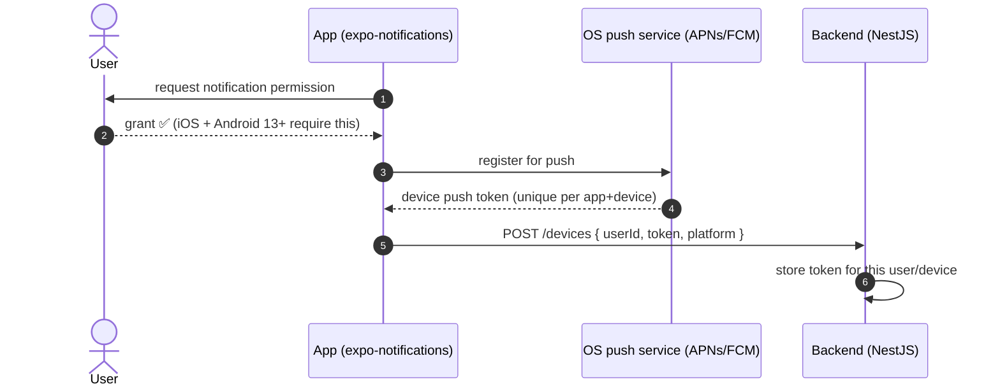
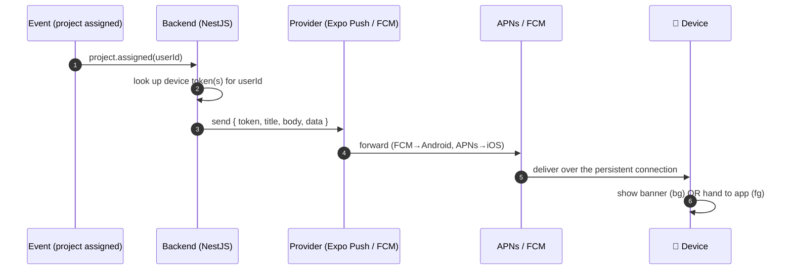
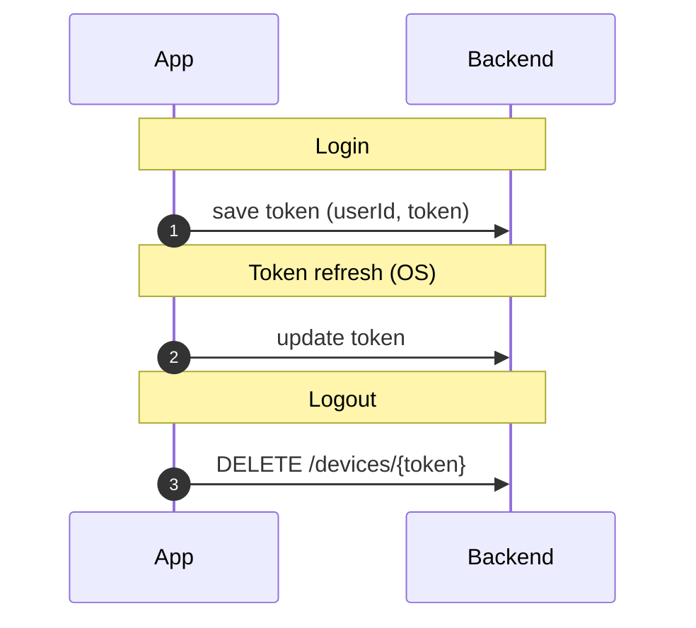
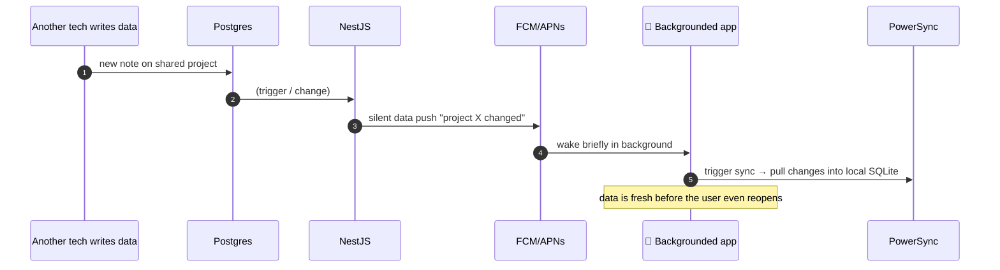

# How Push Notifications Work (Expo + FCM)

A from‑scratch explanation of mobile push notifications, tailored to Moby's stack (**Expo / React
Native + FCM + APNs**, with a NestJS backend). Read top to bottom and you'll understand the players, the
two flows (register + deliver), what happens in each app state, and the offline‑sync tie‑in.

---

## 1. The problem push notifications solve

Your server wants to tell a phone "a project was assigned to you" — even when your app is **closed**. It
can't just open a connection to the phone, because:

- phones **sleep**, switch networks, and change IPs constantly,
- the OS **kills backgrounded apps** to save battery,
- you'd need millions of always‑open sockets.

So Apple and Google each run a **always‑on push service** that every device keeps a *single* persistent
connection to. Your server hands a message to that service; the service delivers it to the device.

- **APNs** — Apple Push Notification service (iOS).
- **FCM** — Firebase Cloud Messaging (Android — and FCM forwards to APNs to reach iOS).

```mermaid
graph LR
  BE["Your backend<br/>(NestJS)"] -->|"send to token"| PS["OS push service<br/>APNs / FCM"]
  PS -->|"one persistent connection"| Dev["📱 Device"]
  Dev -.->|"shows banner / wakes app"| User["👤 User"]
  classDef c fill:#dbeafe,stroke:#3b82f6; class PS c;
```

The device's OS owns that connection — **only APNs can push to an iPhone, only FCM to Android.** Your app
and backend talk *through* them.

---

## 2. The players

| Player | Role |
|---|---|
| **The app** (`expo-notifications`) | Asks the user for permission, registers for push, receives the **device token**, handles incoming notifications |
| **OS push service** (APNs / FCM) | The always‑on delivery network; issues the token; delivers messages |
| **Push provider** (Expo Push Service *or* FCM directly) | What your backend calls to send; it forwards to APNs/FCM |
| **Your backend** (NestJS) | Stores each user's device token(s); sends notifications when events happen |

> **Expo's convenience layer:** instead of integrating APNs *and* FCM yourself, you can use the **Expo
> Push Service** — one token (`ExponentPushToken[…]`) and one API; Expo forwards to FCM/APNs under the
> hood. Or you go **direct to FCM** (FCM relays to APNs for iOS). Moby's eval chose **FCM + expo‑
> notifications** — both paths are shown below.

---

## 3. Flow A — Registration (getting a token)

Before you can send anything, the app must register and hand its **device token** to your backend.



Key points:
- The **token identifies *this app* on *this device*** — it's how the backend addresses a specific phone.
- The app sends it to your backend **after login**, so the backend knows *which user* that device belongs to.
- No permission → no token → no push. (iOS always asks; Android 13+ asks too.)

---

## 4. Flow B — Delivery (sending a notification)

When something happens (a project is assigned), the backend looks up the user's token(s) and sends.



The **Expo path** in detail (one API for both platforms):

```mermaid
graph LR
  BE["NestJS"] -->|"POST exp.host/--/api/v2/push/send<br/>{ to: ExponentPushToken, title, body, data }"| Expo["Expo Push Service"]
  Expo -->|"Android"| FCM["FCM"] --> A["📱 Android"]
  Expo -->|"iOS"| APNs["APNs"] --> I["📱 iPhone"]
  classDef c fill:#dbeafe,stroke:#3b82f6; class Expo,FCM,APNs c;
```

---

## 5. Two kinds of messages

| Type | Who handles it | Use it for |
|---|---|---|
| **Notification message** | The **OS** shows the banner/sound automatically (even if the app is killed). Has `title` / `body`. | User‑facing alerts: "Project assigned", "Clock‑in reminder" |
| **Data (silent) message** | Delivered **to your app's code** — no automatic UI. | Background work: "new data — sync now", badge updates |

Most real apps send a **notification + a data payload** together: the OS shows the banner, and your app
reads the `data` (e.g. a `projectId`) to **deep‑link** when the user taps it.

> iOS throttles **silent** (content‑available) pushes and may delay/drop them to save battery — don't
> rely on them for time‑critical work.

---

## 6. What happens in each app state

```mermaid
graph TD
  In["Push arrives"] --> Q{App state?}
  Q -->|Foreground| F["No OS banner by default →<br/>your listener fires →<br/>you show a custom in-app banner"]
  Q -->|Background| B["OS shows the banner →<br/>tap opens app →<br/>your tap-handler deep-links"]
  Q -->|Killed| K["OS shows the banner (notification msg) →<br/>tap cold-starts app with the payload"]
  classDef g fill:#ecfdf5,stroke:#10b981; class F,B,K g;
```

- **Foreground:** the OS usually does *not* show a banner — your `addNotificationReceivedListener` fires and
  you decide what to render (often a custom toast).
- **Background:** the OS shows the banner; tapping fires
  `addNotificationResponseReceivedListener` → you navigate (deep link).
- **Killed:** notification messages still show; tapping cold‑starts the app and hands you the payload.
  *Silent data messages may not wake a killed iOS app* — a known limitation.

---

## 7. Permissions & token lifecycle

- **Permission** is required (iOS always; Android 13+). Ask at a sensible moment, handle "denied".
- **Tokens change** — on reinstall, restore to a new device, or OS refresh. Re‑register and update the
  backend when the token changes.
- **Register on login, clear on logout.** When a user logs out, tell the backend to **delete that
  device's token** — otherwise the next person on that phone would get the previous user's notifications.
  (This was an explicit Moby requirement.)



---

## 8. The Moby tie‑in — push + offline sync

Moby's notification use cases (from the spec): **project assignment, project updates, time‑clock
reminders, administrative alerts.** NestJS stores tokens per user and sends via FCM/Expo on those events.

There's also a powerful pattern that connects push to the offline‑first architecture: a **silent data
push as a "sync now" signal.** PowerSync's live stream keeps a *foregrounded* app fresh — but when the app
is backgrounded, you can use a data push to nudge it to sync:



So: **PowerSync stream = live updates while the app is open; push = the background nudge** when it isn't.
Together they cover both.

---

## 9. Gotchas

- **iOS needs an APNs key even if you use FCM/Expo** — upload your Apple APNs auth key to Firebase/Expo, or
  iOS push silently fails.
- **Android battery optimization** (OEM "kill" lists) can delay/drop pushes — test on real Samsung/Xiaomi devices.
- **Silent pushes are unreliable on iOS** (throttled) — fine as a "nice to have" sync nudge, not a guarantee.
- **Expo Go limits push** — production push needs a **dev/standalone build** (and the FCM/APNs creds configured).
- **One token per app install** — a user on two phones has two tokens; store many‑to‑one (user → tokens).
- **Never trust the client for *who* to notify** — the backend maps userId → tokens; the client only reports its token.

---

## 10. Mini‑glossary

| Term | Meaning |
|---|---|
| **APNs** | Apple Push Notification service — the only way to push to iOS |
| **FCM** | Firebase Cloud Messaging — Google's push service (relays to APNs for iOS) |
| **Device / push token** | Unique address for one app on one device; the backend sends *to* this |
| **Expo Push Token** | Expo's wrapper token (`ExponentPushToken[…]`) — one token for both platforms |
| **Notification message** | OS‑displayed alert (title/body), shown even when the app is killed |
| **Data / silent message** | Payload delivered to app code with no UI; used to trigger background work |
| **Deep link** | Navigating to a specific screen from a notification tap (via the `data` payload) |
| **content‑available** | iOS flag marking a silent/background push |
