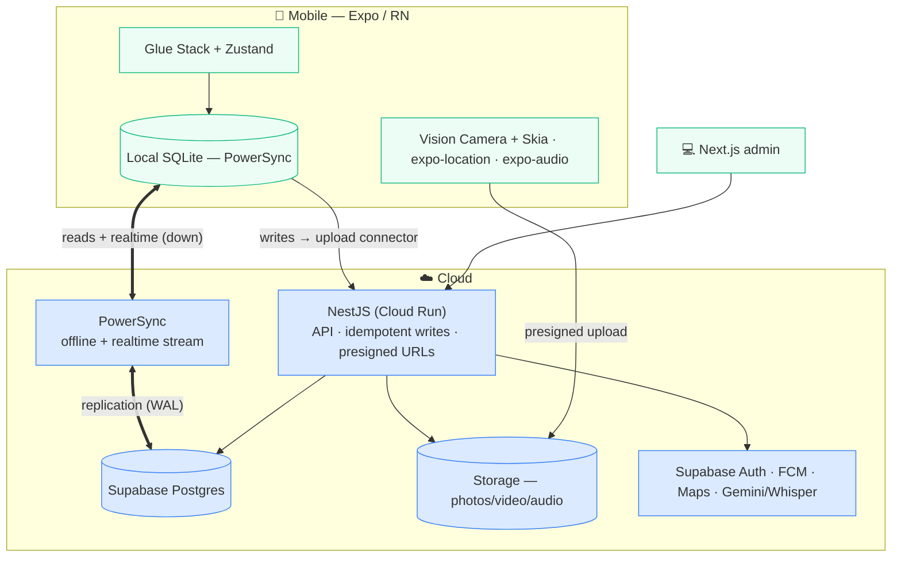

# Moby — Recommended Tech Stack

The technology stack for the RestoPros platform — chosen against your stated requirements and validated by
three hands‑on POCs (Legend‑State, PowerSync, Firebase). **In one line: this is Supabase with the offline
you wanted, plus your own API and realtime, on Google Cloud.**

## Recommendation

> **Mobile** — Expo (React Native) · **Glue Stack** UI · **PowerSync** (on‑device SQLite) · Vision Camera + **Skia** (photo annotation) · expo‑location · expo‑notifications · i18next · Zustand
> **Backend** — **NestJS** (Cloud Run) · **Supabase** (Postgres + Auth + Storage) · **PowerSync Cloud**
> **Web** — Next.js  ·  **Cross‑cutting** — FCM · Google Maps · Gemini/Whisper

Every hard requirement — **offline‑first, relational, realtime, multi‑tenant** — is met by this
combination. Nothing on the list is left to "we'll figure it out later."

## Your requirements → how they're met

| Requirement | How |
|---|---|
| **Offline‑first** (projects, notes, photos, clock‑in work with no signal) | PowerSync + on‑device SQLite |
| **Relational** data with joins | Postgres ↔ SQLite |
| **Realtime** (techs on one project see each other live) | PowerSync sync stream — no separate pub/sub |
| **Multi‑tenant** isolation + roles | Postgres `tenant_id` + Supabase RLS + PowerSync sync rules |
| Passwordless **OTP** (email + phone) | Supabase Auth (email native; phone via Twilio) |
| **Custom camera** (photo/video, flash, zoom) | react‑native‑vision‑camera |
| **Photo annotation** (draw / mark on images) | @shopify/react‑native‑skia |
| **Large uploads** (offline → background → retry) | expo‑file‑system + presigned URLs + expo‑background‑task |
| **Voice notes → transcription** | expo‑audio → server transcription on upload (Whisper / Google STT); optional on‑device (whisper.rn) for instant offline text |
| **AI‑native** structuring of field info | Gemini / Claude via NestJS |
| **GPS** clock‑in (50 m geofence) + 5‑min tracking | expo‑location + expo‑task‑manager |
| **Push** notifications | expo‑notifications + FCM |
| **Localization** (EN → ES → FR) | react‑i18next |
| **Web** admin portal | Next.js + NestJS typed SDK |
| Address autocomplete | Google Maps Places API |

## The stack, by layer

| Layer | Pick | Why |
|---|---|---|
| Mobile | **Expo (RN)**, dev build | Cross‑platform; dev build for native modules |
| Mobile UI | **Glue Stack** | Your team's preferred component library |
| UI state | **Zustand** | Lightweight client/UI state (data lives in PowerSync) |
| Local DB + sync | **PowerSync** (`op-sqlite`) | Offline + realtime in one engine |
| Camera | **react‑native‑vision‑camera** | Custom photo/video, flash, zoom |
| Annotation | **@shopify/react‑native‑skia** | Draw/mark on photos; export the flattened image (`makeImageSnapshot`), gesture‑handler for touch — the production standard, used by Shopify |
| Upload | **expo‑file‑system** + presigned URLs + **expo‑background‑task** | Background, retryable, offline‑durable |
| Audio | **expo‑audio** | Record voice notes |
| Location | **expo‑location** + **expo‑task‑manager** | Geofenced clock‑in + background tracking |
| Push | **expo‑notifications + FCM** | Standard RN push; clear token on logout |
| i18n | **react‑i18next** | EN → ES → FR |
| Server‑state | **TanStack Query** | Caching + retries + loading states for non‑synced NestJS calls (presigned URLs, cloud functions) — what Zustand isn't for |
| Observability | **Sentry** | Crash + error reporting that **caches offline** and flushes on reconnect |
| OTA updates | **Expo EAS Update** | Ship JS/asset fixes to the field instantly (no store review) |
| Backend | **NestJS** (Cloud Run) | Typed API + generated client SDK; the control plane |
| Database | **Supabase Postgres** | Relational, managed |
| Sync service | **PowerSync Cloud** | Managed; self‑hostable later |
| Auth | **Supabase Auth** | Passwordless OTP |
| Storage | **Supabase Storage** / GCS | Photo/video/audio blobs |
| Web | **Next.js** | Admin/office portal |
| Maps / AI | **Google Maps** · **Gemini/Whisper** | Autocomplete · transcription |

## Why this — and not the options you weighed

| Option | Why not |
|---|---|
| **Firebase / Firestore** | NoSQL document model — your data is relational with heavy joins. The per‑document read/write billing and join‑wrangling are exactly the cost + complexity you flagged. |
| **Firebase SQL Connect** | Relational, but **online‑only, no realtime**, and React Native isn't supported (we tested it end‑to‑end). Fails the realtime requirement. |
| **Plain Supabase** | No native offline in 2026 — it needs a sync engine on top. **PowerSync is that engine.** |
| **Legend‑State** | Works, but its store is an in‑memory observable, not real SQLite — weaker for relational data + search at scale. A solid runner‑up, not the pick. |
| **Hand‑rolled** (WatermelonDB + custom sync) | You'd rebuild offline conflict‑handling + realtime yourself — against your "velocity first" priority. |

## The questions you'll ask — answered

- **Is PowerSync mature / worth the cost?** — Production‑mature in 2026 and the most battle‑tested
  local‑first sync engine. At ~3,000 users the cost is trivial, and **POC 2 already proved it end‑to‑end**
  on your data.
- **Aren't we locked in?** — No. It's plain **Postgres + NestJS**. If you ever leave Supabase, you move the
  DB to **Cloud SQL** and self‑host PowerSync — no document‑DB lock‑in, the exact Firebase risk you wanted
  to avoid.
- **Do we need a separate pub/sub for realtime?** — No. **PowerSync's stream is the realtime channel.**
  Nothing extra to build or run.
- **If Supabase is simpler, why not just Supabase?** — Because Supabase alone has no offline. This *is*
  Supabase + the offline you said would make it a slam dunk.
- **Does it fit Google Cloud / Firebase?** — Yes: **NestJS on Cloud Run**, **FCM** for push, **Google Maps**
  for addresses, **Gemini** for transcription. Supabase is managed Postgres; the rest is GCP — where your
  DevOps team is strongest.

## Architecture

**Two planes:** PowerSync is the **data plane** (offline + realtime); NestJS is the **control plane**
(validated, idempotent writes + auth + presigned URLs + business logic). The app reads/writes local
SQLite; PowerSync streams Postgres down and your writes go up through NestJS.

## Production & DX layers

Beyond the data flow, these make it enterprise‑ready:

- **Server‑state — TanStack Query.** The triad: **PowerSync** = synced offline data · **TanStack Query** = non‑synced server calls (presigned URLs, AI triggers, admin actions) with caching + retries for spotty networks · **Zustand** = pure UI state. Three jobs, no overlap.
- **Observability — Sentry** (+ GCP Cloud Logging/Trace for NestJS). Offline‑first hides failures — a stalled background sync or a local‑query crash is invisible until reconnect. Sentry **caches errors on device and flushes them on reconnect**, plus crash + performance. (Datadog RUM is a heavier enterprise add for later.)
- **OTA updates — Expo EAS Update.** Push JS/asset fixes to field devices instantly, skipping store review (native‑module changes still need a build). Key for fast AI/UX iteration.
- **Edge AI (optional, Phase 2) — on‑device transcription.** `whisper.rn` transcribes voice notes **offline** so text is instant in a basement; the LLM still structures it server‑side on reconnect. Trade‑offs: the model adds ~75–150 MB to the app, on‑device accuracy (esp. Spanish) is lower, and you still sync the original audio for the record — so it's an enhancement over the server baseline, not a replacement.
- **UI — Glue Stack (kept).** Tamagui is a strong compile‑time‑optimized alternative, but UI‑lib perf isn't the bottleneck here (long lists + the Skia canvas are, and those are optimized directly) and your team prefers Glue Stack. Reconsider Tamagui only if you want one component codebase shared across Next.js web + RN.

## Bottom line

This is the **fastest path that meets all four hard requirements at once** — offline, relational,
realtime, multi‑tenant, with **your own Postgres and API** (portable, no lock‑in),
and **already proven** in the POCs. It's Supabase for velocity, PowerSync for the offline + realtime
Supabase lacks, and NestJS for the control you want over your data.
