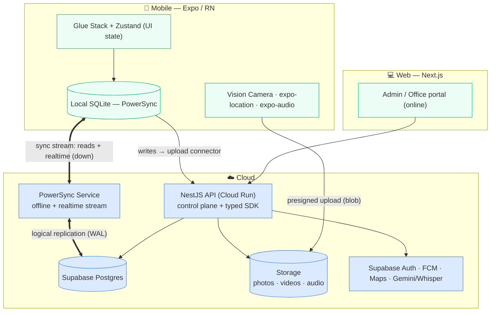

# Moby — Recommended Tech Stack

The recommended end‑to‑end stack for the **RestoPros restoration platform** MVP. Grounded in the product
spec, the technical evaluation (2026‑06‑02), and three hands‑on POCs — Legend‑State, PowerSync, and
Firebase SQL Connect (see `HOW_IT_WORKS_POC1.md`, `HOW_IT_WORKS_POC2.md`, `POC3_FIREBASE_FINDINGS.md`).

## TL;DR

> **Mobile** — Expo (React Native) · Glue Stack · **PowerSync** (on‑device SQLite) · React Native Vision Camera · expo‑location · expo‑notifications · i18next · **Zustand** (UI state)
> **Backend** — **NestJS** (Cloud Run) · **Supabase** (Postgres + Auth + Storage) · **PowerSync Cloud**
> **Web** — Next.js  ·  **Cross‑cutting** — FCM · Google Maps Places · Gemini/Whisper (transcription)

In one line: **this is "Supabase with the offline you wished it had."** Supabase gives the managed
Postgres + Auth + Storage velocity you asked for; **PowerSync** adds the offline‑first **and** realtime
that Supabase lacks natively — on the GeekyAnts COE (NestJS / Next.js / Expo), aligned to your GCP/Firebase team.

## What the stack must deliver (from the spec + the eval)

Offline‑first · relational data with joins · **realtime** (multiple techs on one project see changes
live) · multi‑tenant (~150 locations × ~20 users ≈ 3,000) · passwordless OTP (email + phone) · custom
camera (photo/video, flash, zoom) · large media uploads (offline → background → retry) · voice notes →
AI transcription · GPS clock‑in (50 m geofence, track every 5 min) · push (FCM) · localization (EN → ES →
FR) · web admin portal. **Priority #1 stated repeatedly: development velocity** (managed services fine,
cost not a concern, vendor lock‑in acceptable for the MVP, GCP/Firebase expertise in‑house).

## The one decision that matters: the sync engine → **PowerSync**

Supabase has **no native offline in 2026** — you pair it with a sync engine. Of the options:

| Engine | Verdict for Moby |
|---|---|
| **PowerSync** ✅ | On‑device **SQLite** (relational + complex offline queries + search), offline **read *and* write**, **realtime stream built in** (no separate pub/sub), mature **conflict handling** + sync rules for multi‑tenant scoping. First‑class Supabase + React Native. "Most production‑tested local‑first sync engine; recommended where sync correctness is a business requirement" — which is exactly multi‑tech offline editing. |
| Legend‑State *(runner‑up)* | Lighter/faster to wire, but its local store is an **observable + AsyncStorage, not real SQLite** — weaker for Moby's relational data, search, and scale. Realtime is borrowed from Supabase Realtime. Great if the offline dataset stays small/simple. |
| ElectricSQL | **Read‑path only — "does not do write‑path sync."** Offline *writes* (Moby's core need) are DIY. Out. |
| WatermelonDB | Solid offline SQLite, but **you hand‑roll the sync protocol + realtime** — against the "velocity #1, managed‑OK" priority. |
| Firebase (Firestore / SQL Connect) | Ruled out — no single Firebase product is relational **and** offline **and** realtime (`POC3_FIREBASE_FINDINGS.md`). |

## The full stack

| Layer | Pick | Why |
|---|---|---|
| Mobile shell | **Expo (RN)**, dev build | COE standard; dev build needed for native (SQLite, camera, location) |
| Mobile UI | **Glue Stack** | COE standard |
| UI state | **Zustand** | COE standard; lightweight (see state section) |
| Local DB + sync | **PowerSync** (`@powersync/op-sqlite`) | Offline‑first + realtime in one engine |
| Camera | **react‑native‑vision‑camera** | Custom photo/video, flash, zoom, future annotation |
| Media upload | **expo‑file‑system** streaming + presigned URLs + **expo‑background‑task** | Background, retryable, offline‑durable |
| Audio | **expo‑audio** | Record voice notes → upload → transcribe |
| Location | **expo‑location** + **expo‑task‑manager** | Geofenced clock‑in + 5‑min background tracking |
| Push | **expo‑notifications + FCM** | COE/eval decision; clear token on logout |
| i18n | **react‑i18next** | EN → ES → FR |
| Backend | **NestJS** (TypeScript, typed client SDK) on **Cloud Run** | COE standard; control plane + business logic; GCP‑hosted |
| Database | **Postgres** via **Supabase** | Relational; managed; the Postgres PowerSync taps |
| Sync service | **PowerSync Cloud** | Managed; self‑hostable later |
| Auth | **Supabase Auth** | Passwordless email OTP native; phone OTP via Twilio |
| Storage | **Supabase Storage** (or GCS) | Photo/video/audio blobs via presigned upload |
| Web | **Next.js** | Admin/office portal (online; typed SDK) |
| Maps | **Google Maps Places API** | Address autocomplete |
| AI | **Gemini** (GCP) / **Whisper** | Voice transcription + note structuring (async via NestJS) |

## Architecture

## Every requirement → how it's covered

| Requirement | Tech |
|---|---|
| Offline‑first (projects, notes, photos, clock, updates) | PowerSync + SQLite |
| Relational + joins, multi‑tenant hierarchy | Postgres ↔ SQLite |
| **Realtime** (multi‑tech same project) | PowerSync stream — **no separate pub/sub** |
| Tenant isolation + roles | Postgres `tenant_id` + Supabase **RLS** + PowerSync **sync rules** |
| Passwordless OTP (email + phone) | Supabase Auth (email native; phone via Twilio) |
| Custom camera | react‑native‑vision‑camera |
| Large uploads (offline → bg → retry) | expo‑file‑system + presigned URLs + expo‑background‑task; metadata syncs via PowerSync, blob goes separately |
| Voice → transcription | expo‑audio → upload → Whisper / Google STT (async via NestJS) |
| AI‑native structuring | Gemini / Claude via NestJS jobs |
| GPS clock‑in (50 m) + 5‑min tracking | expo‑location (geofence + background) + expo‑task‑manager |
| Push notifications | expo‑notifications + FCM |
| Localization (EN/ES/FR) | react‑i18next |
| Web admin (tenant/user/project) | Next.js + NestJS typed SDK |
| Address autocomplete | Google Maps Places API |

## How it fits the COE (and answers "do we need a separate pub/sub?")

You **keep NestJS + the typed‑SDK pattern.** PowerSync slots in beside it as a second plane:

- **PowerSync = the data plane** — the synced tables (projects, notes, photo metadata, time entries,
  contacts). Reads stream into SQLite; writes queue and the **upload connector POSTs to NestJS**, which
  validates, applies **idempotency keys**, enforces tenant rules, writes Postgres, and fires AI/notifications.
- **NestJS = the control plane** — auth, presigned URLs, AI jobs, admin/web APIs, and the PowerSync upload
  endpoint. The COE's typed SDK is unchanged.
- **Realtime is free** from PowerSync's stream → **no Socket.IO, no separate pub/sub to build.**

## State management — Zustand vs Legend‑State (they're different layers)

- **Zustand = client/UI state only** — in‑memory React state (+ optional simple persist), **no backend
  sync**. For filters, modal/sheet open, wizard step, camera mode, theme.
- **Legend‑State = state manager *plus a sync engine*** — observables **+ offline persistence + backend
  sync + realtime**. It can *be* your offline data layer.

The decision isn't "which state manager" — it's **what kind of state**: server/synced data → a sync
engine (PowerSync); local UI/ephemeral → Zustand. Don't put server data in Zustand (no sync correctness);
don't use Legend‑State for a modal boolean (overkill).

**For Moby:** PowerSync's SQLite (`useQuery`) is the data layer, so → **Zustand for UI state, and
Legend‑State is not needed** (PowerSync already fills its sync role). Clean split: **PowerSync = data,
Zustand = UI.**

## Why not PowerSync + Firebase SQL Connect

A natural question — PowerSync does realtime, SQL Connect is relational, so why not combine them? Because
**PowerSync doesn't *add* realtime *to* SQL Connect — it *replaces* SQL Connect's entire client data path.**

- **SQL Connect is an API layer *on top of* Postgres** — the client talks to its GraphQL.
- **PowerSync is a sync layer that taps Postgres *underneath*** (via the replication log) — the client
  talks to PowerSync's stream and **never calls the API.**

So with PowerSync, SQL Connect's whole reason to exist (the typed GraphQL API + auth) is bypassed — you'd
be using it as nothing but a managed Cloud SQL instance, while PowerSync needs **raw logical‑replication
access** (which a managed API product may restrict) and its writes hit the **raw tables** (fighting SQL
Connect's schema management). Net: `PowerSync + SQL Connect = PowerSync + dead weight`. If you want
PowerSync, give it a **plain Postgres** — Supabase's (POC 2) or your own Cloud SQL — never SQL Connect.

## Why this is ideal for Moby

- **Velocity #1** — Supabase delivers managed Postgres + Auth + Storage on day one; PowerSync delivers
  offline + realtime without hand‑rolling sync. Phase‑1 (2 weeks) is very achievable.
- **Senthil's stated slam‑dunk** — "if Supabase had offline, let's just go with Supabase." This *is*
  Supabase + offline.
- **GCP/Firebase aligned** — NestJS on Cloud Run, FCM, Google Maps, Gemini — plays to your DevOps team.
- **Portable later** — it's plain Postgres + NestJS; if you ever leave Supabase, move the DB to Cloud SQL
  and self‑host PowerSync. No document‑DB lock‑in (the Firebase fear).

## Risks to plan for (not stack‑breakers)

1. **iOS background GPS every 5 min** — needs "Always" permission + careful background‑location config;
   the trickiest native piece. Budget time.
2. **Background large‑file uploads** — iOS throttles background execution; design as "resume on next
   foreground/reconnect," which PowerSync's synced metadata + a retry queue handle cleanly.
3. **PowerSync is one more managed component** — accepted trade for not hand‑rolling sync; self‑host later
   if cost/control ever demands it.

## Alternatives at a glance

- **Runner‑up:** Supabase + **Legend‑State** — if you want the absolute lightest setup and the per‑tech
  offline dataset stays small. Loses the real‑SQLite/scale edge.
- **"Own the backend" variant:** your own **Cloud SQL Postgres + self‑hosted PowerSync** + NestJS — same
  architecture, fully self‑owned; more infra to run. Sensible post‑MVP if you outgrow managed Supabase.
- **Ruled out:** Firebase (relational + offline + realtime impossible together), ElectricSQL (no offline
  writes), fully hand‑rolled WatermelonDB + Socket.IO (too much to build for an MVP).

---

*Sources: Supabase has no native offline in 2026 (pairs with Legend‑State / WatermelonDB / PowerSync);
PowerSync × Supabase is first‑class and production‑tested for sync correctness; ElectricSQL is read‑path
only. See the linked POC docs in this repo for hands‑on results.*
